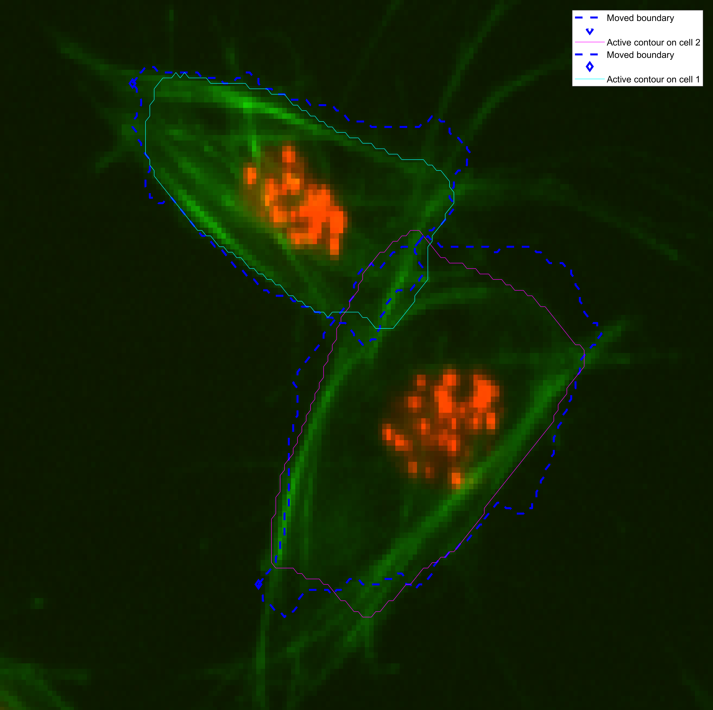

# Shape Evolution: CLUMPS
This log file follows the development made in the
[`shapeevolution-log.md`](./shapeevolution-log.md) file, where a track was
selected inside a range of frames, and its evolution was matched by
moving the boundary of the known frame `knownfr` to the position of the
unknown frame `ukfr`. From this point, the boundary was deformed to fit the
unknown frame.
## Discover frame range for analysis
First of all, determining a clump needs to be studied, can be selected by the
function [`searchClumpOnFrame.m`](../searchClumpOnFrame.m). Once the clump has
been identified, the objective is to get the frames before the clump is formed,
where both participating cells are present, until the end of the _life_ of the
clump.

Some clumps may disappear and reappear because
+ the participating cells detached and then reattached into the clump.
+ a new cell or clump attached to the current clump and then detached
from it.

Either way, the objective of this frame range selection is to have the frame(s)
leading up to a clump, and the first _lifespan_ of the clump.
### Dataset holes
Places where the original phagosight implementation have caused something to
lose the segmentation labels on the images, and therefore no analysis can be
made on them. As a measure, they are being removed from the analysis, after
selecting the range. These are stored in file `DATASETHOLES.mat`:
```Matlab
DATASETHOLES = [75 119 161 180 195 302 520];
```
The way to remove them from the analysis, after selecting the appropriate
range of frames:
```Matlab
trackinfo(ismember(trackinfo.timeframe,DATASETHOLES),:) = [];
```
### Detection of clump (and cells') _lifespan_
Getting the exact lifespan of the clump.
```Matlab
z = unique(trackinfo.timeframe((trackinfo.clumpcode==wuc)));
```
```Matlab
zini = [];
zfin = [];
for ix=1:length(clumplab)
    testv = trackinfo.timeframe(trackinfo.finalLabel==clumplab(ix),:);
    zini = [zini min(testv)];
    zfin = [zfin max(testv)];
end
zini = max(zini);
zfin = min(zfin);
```
## Changes from the previous _shape evolution_ code
### Determining the `trackinfo` variable: _what changed?_
### Following of cell through cross correlation
## Deformation of shape based on Active Contours
+ Parameters
+ Initial point
### Preliminary Results


## Steps to follow two cells within a clump.
