# Iterative Shape Evolution (Leak-prevention)
This log file follows the development described in the
[`shapeevolution-iterative.md`](./shapeevolution-iterative.md) file.
The script file
[`script_iterevolve-vs-leaking.m`](../script_iterevolve-vs-leaking.m)
is described in this case, which is a condensed version of
[`script_iterevolve.m`](../script_iterevolve.m)
that allows to make the detection and handling of leaking segmentation
more straightforward.
## The problem so far:
The following image makes the problem explicit:

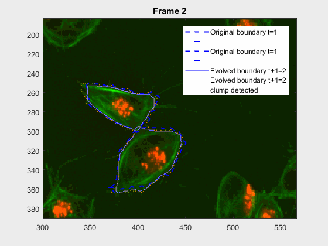

The code so far can handle easy clumps, but in some cases, the segmentation
leaks and takes another cell. In this log (and `.m`) file(s) the priority
falls into detecting

## The code in its most essential form
The code developed in [`script_iterevolve.m`](../script_iterevolve.m)
is displayed, in a condensed form. All of the functions used are part of the
@macrosight package.
```Matlab
% 1. Load known frame
tk=1;
framet = trackinfo.timeframe(tk);
[knownfr] = getCommonVariablesPerFrame(handles, trackinfo, wuc, ...
    filenames{framet}, framet);
% 2. Compute the tracks' variables in the known frame
[kftr] = getKnownTracksVariables(knownfr, trackinfo, clumplab, tk);

%% 3.1 Load the unknown frame
tkp1 = tk+1;
frametplusT = trackinfo.timeframe(tkp1);
[ukfr] = getCommonVariablesPerFrame(handles, trackinfo, wuc, ...
    filenames{frametplusT}, frametplusT);
% 3.2 Evolve
acopt.method = 'Chan-Vese';
acopt.iter = 50;
acopt.smoothf = 1.5;
acopt.contractionbias = -0.1;
acopt.erodenum = 5;
[newfr] = nextframeevolution(ukfr, kftr, trackinfo, clumplab, acopt);

% 3.4 Update
% 3.4.1 Update knownfr
[knownfr, kftr] = updateKnownFrame(ukfr, newfr, clumplab);
if ukfr.hasclump == true && false % change to true for updating info to disk
    update2disk(handles, knownfr, newfr, wuc);
end
framet = frametplusT;
tk = tk+1;
```

## Shape tests
Two shape tests will be conducted to try and identify the calculations
necessary to detect a potential leaking with the segmentation, and maybe
provide a better solution to the problem. At the moment, the function
`activecontour` is being used _naively_, if the segmentation provided by it
can be assessed and fixed in the case of leaking, then A better approach, a
dynamic tweak in the parameters or disregarding one sector of the segmentation
altogether might be implemented.
#### Region properties
There are two major proposals in this area. The first is to calculate some
_traditional_ shape parameters like of each of the cells, at each segmentation
point. Next, a description of each parameter is presented and how it is
calculated:
+ `Area` covered by the segmented pixels after the shape evolution
`newfr.evolmask`. This is computed by Matlab's `regionprops`.
+ `aspectRatio = MinorAxisLength./MajorAxisLength;`
+ `circularity = (4*pi).*(Area./(Perimeter.^2));`
+ `EquivDiameter`This is computed by Matlab's `regionprops`.
+ `Solidity` This is computed by Matlab's `regionprops`.
+ `Perimeter` This is computed by Matlab's `regionprops`.
#### Anglegram measurements
The other approach to find leaking in a segmentation is to compute the
_anglegram_ of each cell involved in the overlapping. My hypothesis is that
this way, not only will we come to the detection of a leak, but also the right
positions where the segmentation can be ignored, because it does not follow a
**normal** curvature.
+ `meanAg = mean(candyhandles.angleSummaryVector);`
+ `stdAg = std(candyhandles.angleSummaryVector);`
+ `frobNorm = norm(anglegram, 'fro');`
+ `maxsvd = max(svd(anglegram));`
+ `rankAG = rank(anglegram);`
+ `rankRatio = rankAG/size(anglegram,2)`

Both tests will start by testing a couple of cases where there is no overlap
and the cells involved are just moving in time. Then, the tests will move on
to clumps `wuc=8007` and `wuc=11010`, which do overlap.
## NON OVERLAPPING
### NON OVERLAPING EXAMPLE: `wuc=8002` in frames `418:468`
In this case, two non-overlapping cells were followed from `wuc=8002` to
assess the different measurements described before. The cells assessed in this
case are as follows:

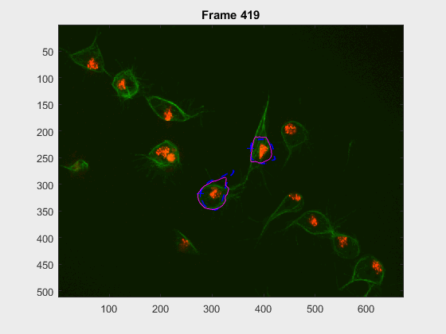

#### Results
The _anglegrams_ of both cells are also shown following that same evolution
of frames.

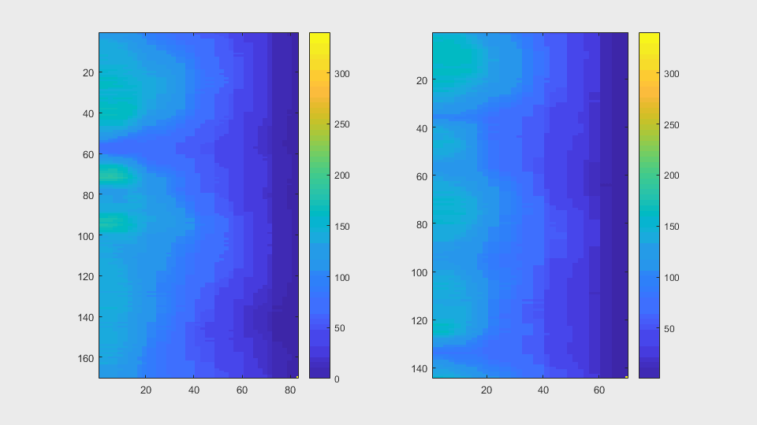

Finally, the measurements with the `diff()` are shown below.

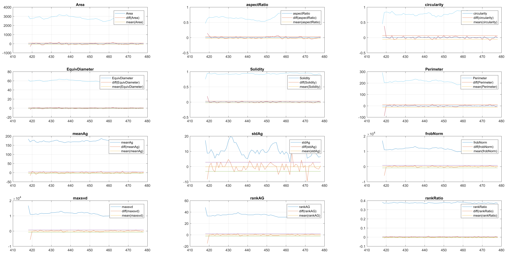

### NON OVERLAPING EXAMPLE: `wuc=8002` in frames `386:416`
In this case, two non-overlapping cells were followed from `wuc=8002` to
assess the different measurements described before. The cells assessed in this
case are as follows:

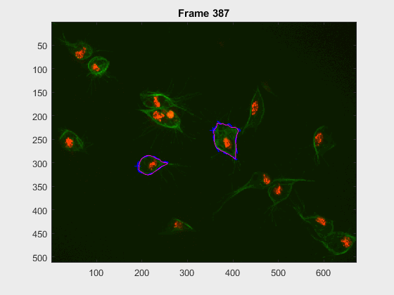

#### Results
The _anglegrams_ of both cells are also shown following that same evolution
of frames.

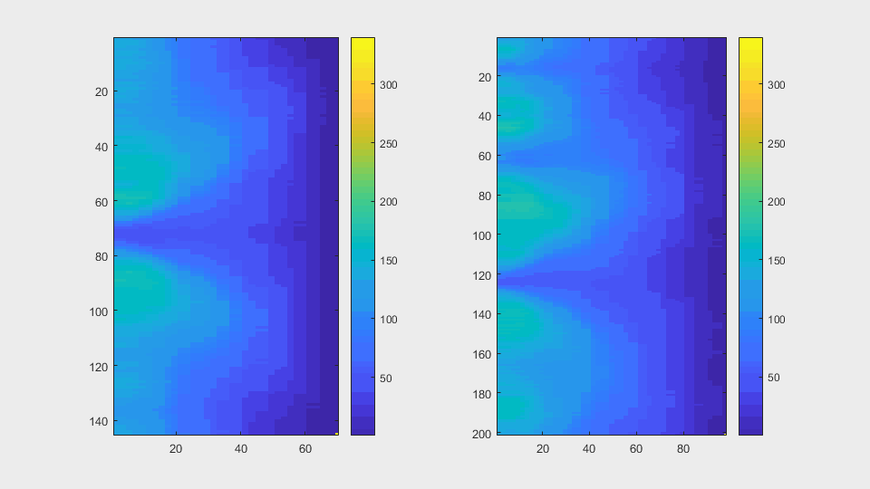

Finally, the measurements with the `diff()` are shown below.

[**Cell 2**](../figs/measurements-clump8002-318to416frames-2.eps)
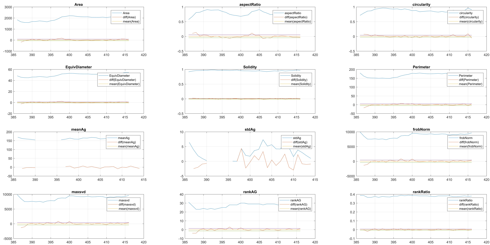

[**Cell 8**](../figs/measurements-clump8002-318to416frames-8.eps)
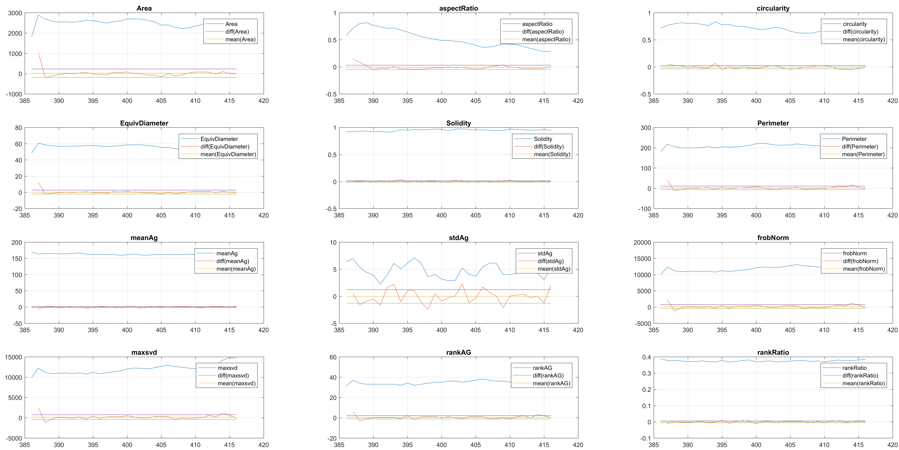

## OVERLAPPING
### OVERLAPPING EXAMPLE: `wuc=8007` in frames `15:50`
Two overlapping cells were followed from `wuc=8007` to
assess the different measurements described before.
**Overlapping begins in frame `19`.**
The cells assessed in this case appear as follows:

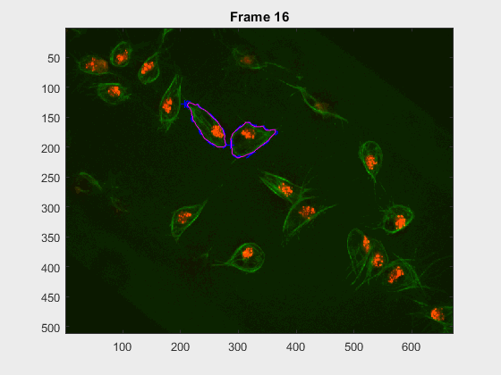

#### Results
The _anglegrams_ of both cells are also shown following that same evolution
of frames.

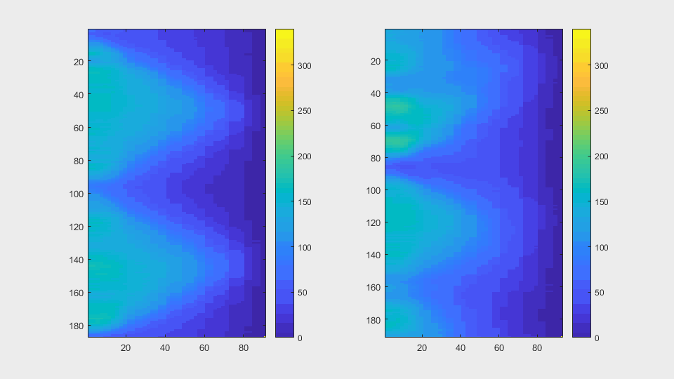

Finally, the measurements with the `diff()` are shown below.

[**Cell 7**](../figs/measurements-clump8007-15to50frames-7.eps)
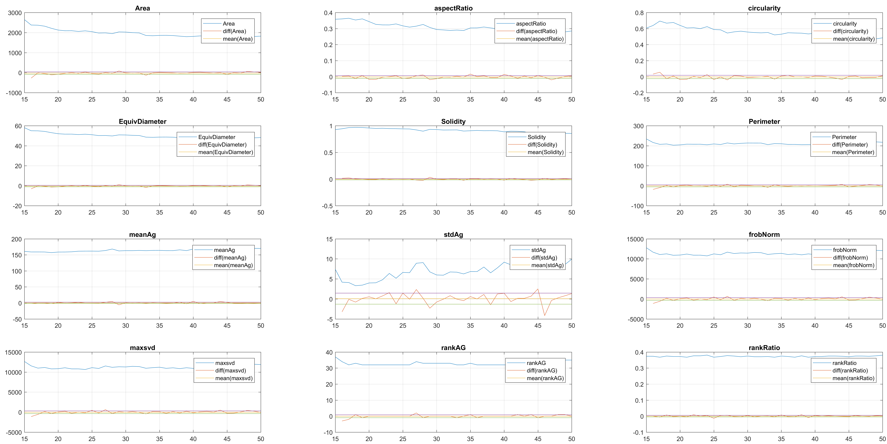

[**Cell 8**](../figs/measurements-clump8007-15to50frames-8.eps)
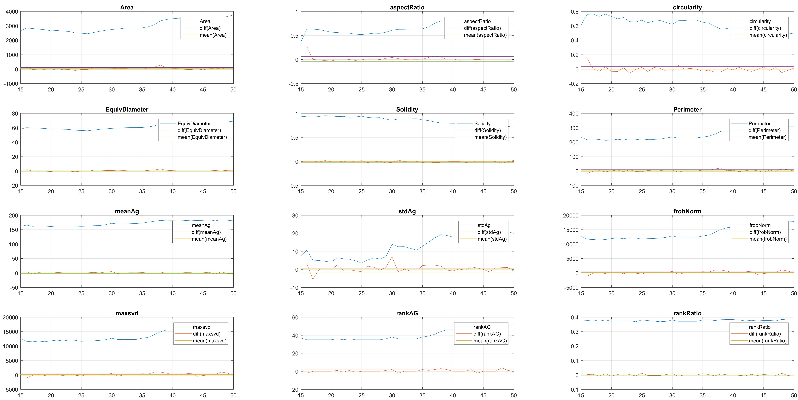

### OVERLAPPING EXAMPLE: `wuc=11010` in frames `1:70`
Two overlapping cells were followed from `wuc=11010` to
assess the different measurements described before.
**Overlapping begins in frame `2`.**
The cells assessed in this case appear as follows:

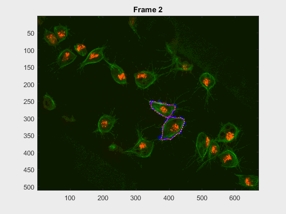

#### Results
The _anglegrams_ of both cells are also shown following that same evolution
of frames.

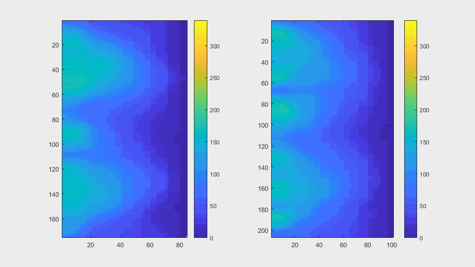

Finally, the measurements with the `diff()` are shown below.

[**Cell 10**](../figs/measurements-clump11010-1to70frames-10.eps)
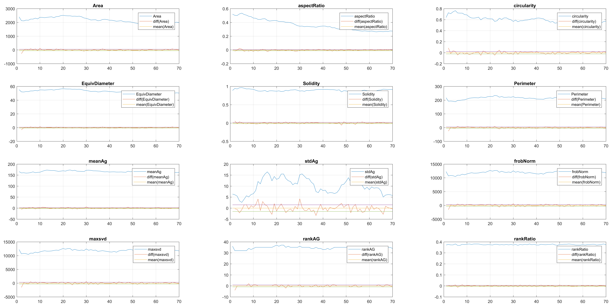

[**Cell 11**](../figs/measurements-clump11010-1to70frames-11.eps)
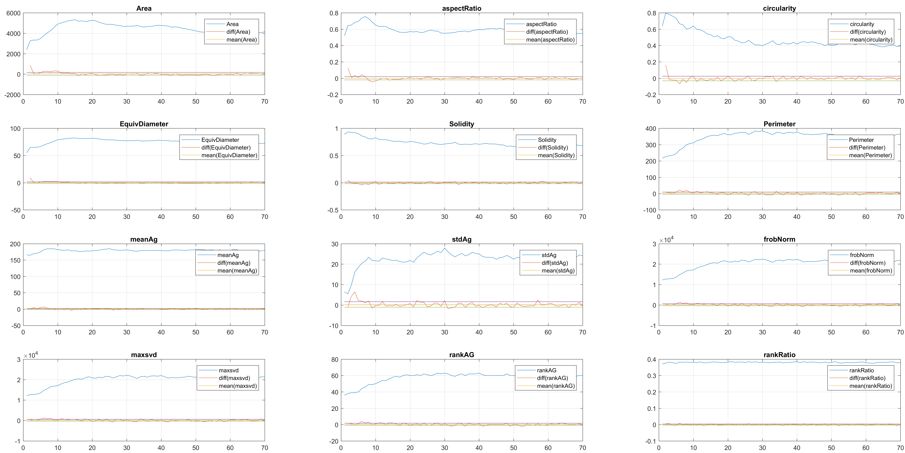

### A brief discussion
It can be seen that the cells that appear _below_, that is cell `8` from
clump `wuc=8007` and cell `11` of clump `wuc=11010` are the ones where the
segmentation is leaking; whereas the cells that appear _above_ in their
respective clumps have what seems to be a better segmentation.
### A couple of ideas:
+ (Original idea) use the measurements described here to catch a bad
  segmentation.
+ Since one of the segmentations seems to work... remove **that** from the frame
  and try to re-do the bad segmentation...
+ _Track_ each point in the boundary as it moves from frame to frame.. many
  problems, but might work.. have like a _keyhole algorithm_ but for the shape,
  then weird movements would probably be detected.
