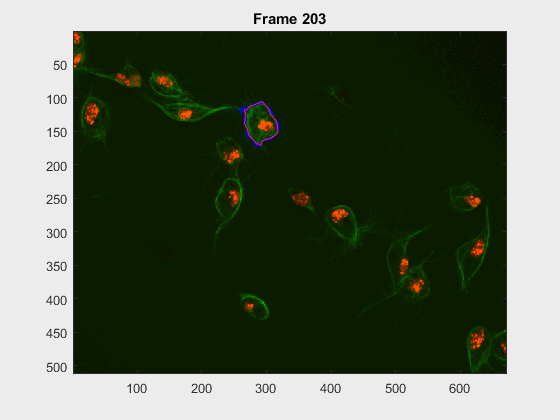
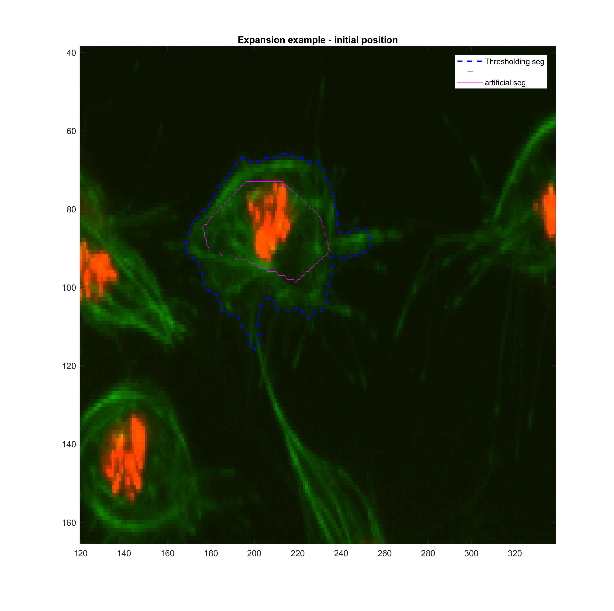
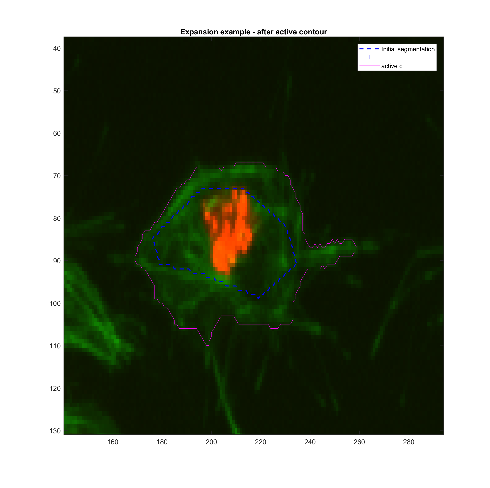
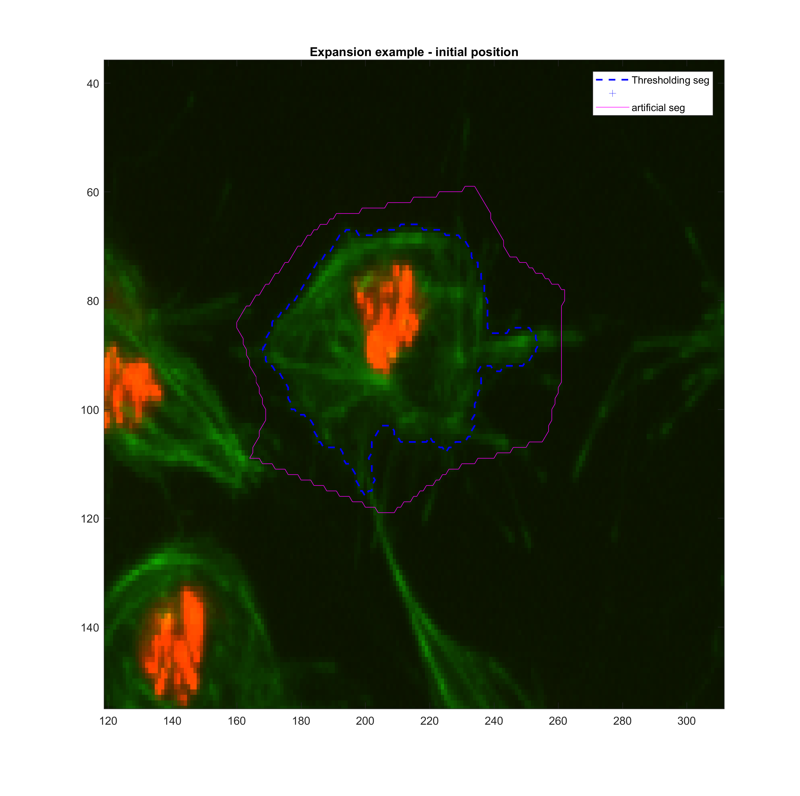
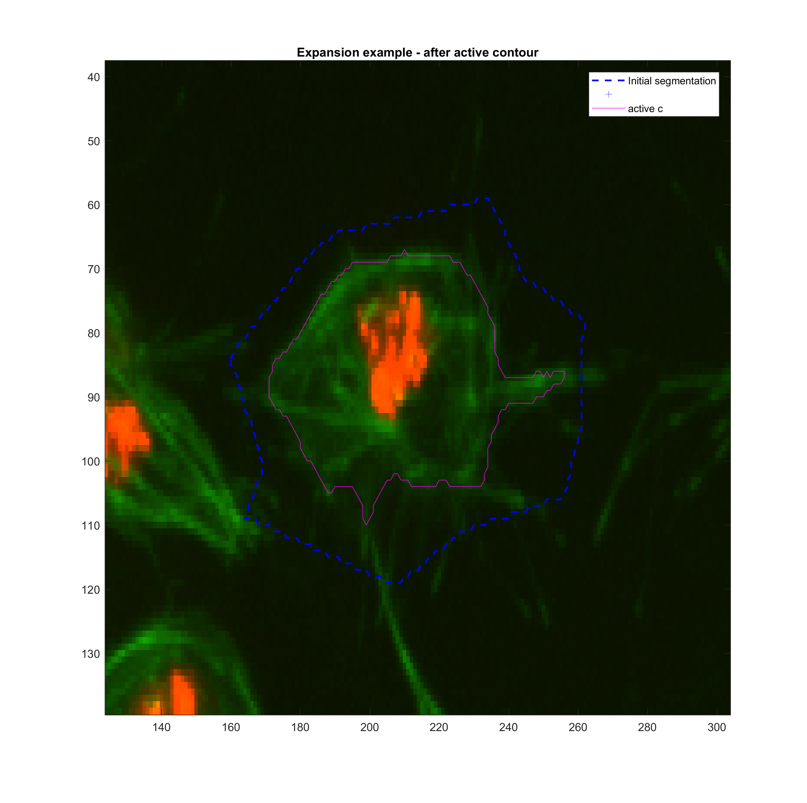
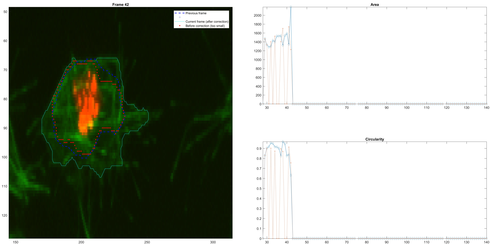
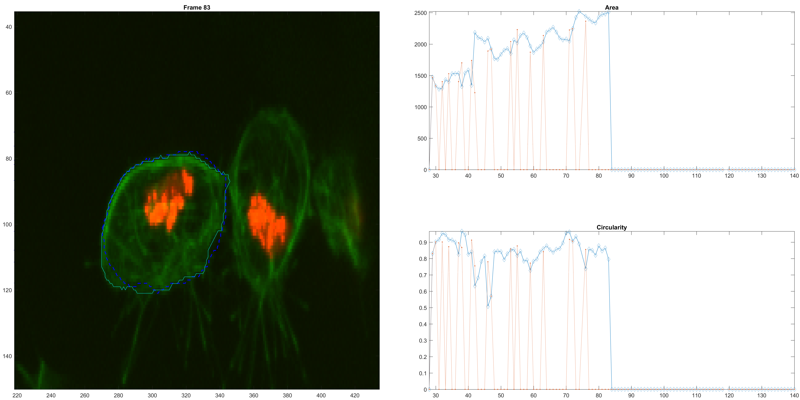
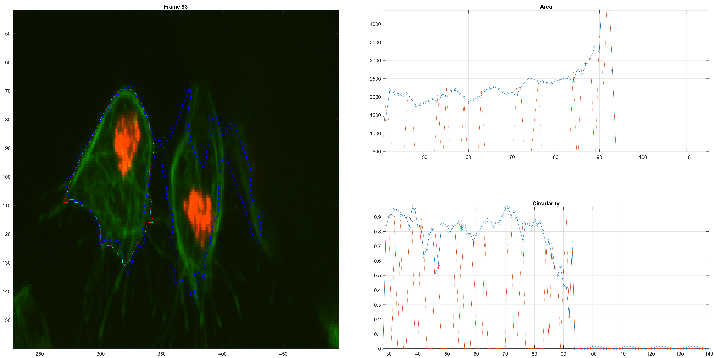
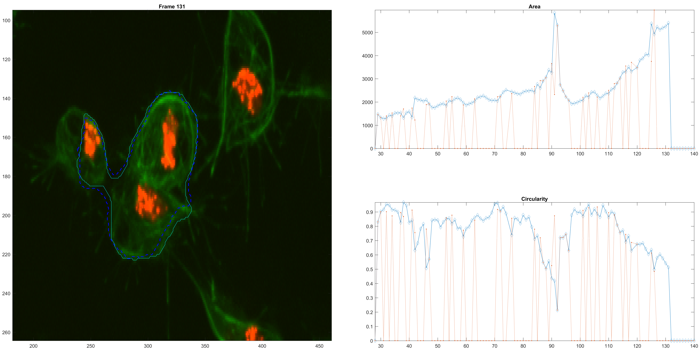
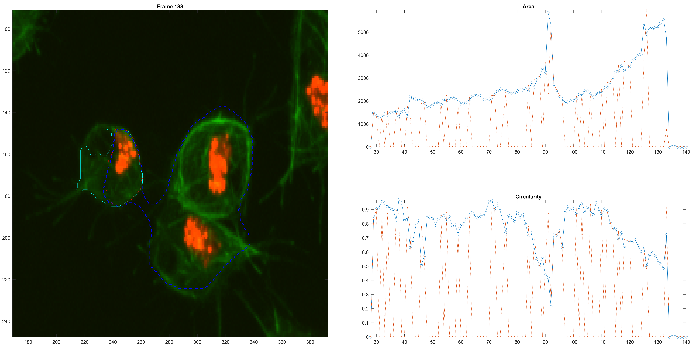

  # Evolution of shape: restrictions and active contours' parameters
This log file is a continuation of the file
[`scr-iteravolution-vs-leaking.md`](./scr-iteravolution-vs-leaking.md).
The focus of this (hopefully small) log file is to address some issues
that occur with the segmentation in the previous file regarding the
shape of the cell being segmented and the control we can **realistically**
have over the MATLAB function `activecontour.m`.

We know about the parameters of `activecontour.m` that can be addressed,
they involve:
+ **Method:** Choose from `'Chan-Vese'` and `'edge'`
+ **Iterations:** How many times the program is run. Typical values used here
are `options.iter=25` and `options.iter=50`.
+ **Smooth Factor:** Parameter that forces the contour to be _soft, smooth
or regular_. Typical values used in this application are
`options.smoothf= 1.5` and `options.smoothf= 2`, when the method used is
`Chan-Vese`.
+ **Contraction Bias:** Is the tendency of the contour to expand or shrink.

This function does not allow a finer control over the parameters, the
evolution or the finer details (restricting size, volume or area of the
contours).

## Minor setback exposing a problem: Cell `2`
Upon trying to compute the method for all the independent cells, some mistakes
in the evolution of the shape were found. And because of the nature of the
evolution, where a a frame at `t(k+1)` is created from the previous
`t(k+1)=tk+1`, the errors in segmentation in one frame can be passed
on to the subsequent ones.

For this experiment, the cell at `tracklabel=2` was examined in two different
experiments: from frames `28:300` and `202:300`. In this case, there were many
objectives:
+ Follow a cell over  long span of frames, and see how the following mechanism
would cope.
+ Follow a single cell even though it might go through clumps.
+ See how different would the cells be segmented when starting at different
points.
  + How would cell `2` look at frames `>230` when starting at frame `28`?
  + how would it look upon starting at frame `202`?

Some results were found, the `.gif` files appear below
###### Frames `28:300`

###### Frames `202:300`


The method is able to cope with the following of the cell, but
1. Segmentation errors are passed on between frames and only in specific
scenarios does the segmentation fixes itself.
2. In frames where a clump is found, the segmentation falls into even more
traps or leaks.
3. Noticeably, the segmentation from frames `230:300` becomes pretty much the
same, even with the very different segmentation results at frame `202`.
The measurements were taken, just as in the script file
[`scr-iteravolution-vs-leaking`](./scr-iteravolution-vs-leaking.md#non-overlaping) and the measurements matched after some frames (not shown).

## Control of area (and other shape measurements)
#### Generic examples
For this section of the log, an initial analysis is made with the
`activecontour` function. A generic example is tried.

```Matlab
I = imread('toyobjects.png');
figure(1)
imagesc(I);

mask = roipoly;

figure(2)
imagesc(mask);
title('Initial MASK');
```
Now the parameters, and the actual function:
```Matlab
acopt.method = 'Chan-Vese';
acopt.iter = 200;
acopt.smoothf = 1.5;
acopt.contractionbias = 0;
acopt.erodenum = 5;

evomask = activecontour(I, mask, acopt.iter, acopt.method, ...
'ContractionBias',acopt.contractionbias,'SmoothFactor', acopt.smoothf);
figure(3)
plotBoundariesAndPoints(I, bwboundaries(mask), bwboundaries(evomask), 'm-');
```
#### Real data tests
+ Run `initscript` so we have access to the `handles` structure.
+ Images where some problems can be found for cell `2` are frames `43, 96`.

The painless way to run tests:
```Matlab
initscript;
```
Then just load everything:
```Matlab
a = getdatafromhandles(handles, filenames{43})
clumplab = 2;
wuc = 2;
trackinfo = [tablenet(ismember(tablenet.track, clumplab),[5 1 2 11 13 14]) ...
clumptracktable(ismember(tablenet.track, clumplab),:)];
```
Plot the image (with current segmentation) and get a different one with
`roipoly`, that will simulate a previous step:
```Matlab
plotBoundariesAndPoints(a.X,...
   bwboundaries(a.dataGL==trackinfo(trackinfo.timeframe==43,:).seglabel));
mask = roipoly;
```
Get the parameters for the `activecontour`,
```Matlab
acopt.method = 'Chan-Vese';
acopt.iter = 200;
acopt.smoothf = 1;
acopt.contractionbias = -0.25;
acopt.erodenum = 5;
```
finally, just run the routine:
```Matlab
evomask = activecontour(a.dataGR, mask, acopt.iter, acopt.method, ...
'ContractionBias',acopt.contractionbias,'SmoothFactor', acopt.smoothf);
```

The same funciton `roipoly` was used to simulate a smaller or larger segmented
area for frame `t(k-1)`. Then, various tests with the function `activecontour`
were done in order to get a sense

**Growing**

|method|iter|smoothf|contractionbias|erodenum|
|:---:|:---:|:---:|:---:|:---:|
|Chan-Vese|200.00|1.00|-0.25|5.00|
 

**Shrinking**

|method|iter|smoothf|contractionbias|erodenum|
|:---:|:---:|:---:|:---:|:---:|
|Chan-Vese|100.00|1.25|0.10|5.00|
 

These parameters may need to be changed when addressing clumps.

## Developing a better area control
The approach described before was implemented in a crude way. At each step,
the size (Area) of the new frame is compared with the previous size. A
large change results in the adjustment of the

**An example of size correction.**


**Right before a clump.**


**A clump confusion.**


**A bigger confusion.**


**A loss of the original cell because of the confusion.**


###### Some area measurements
