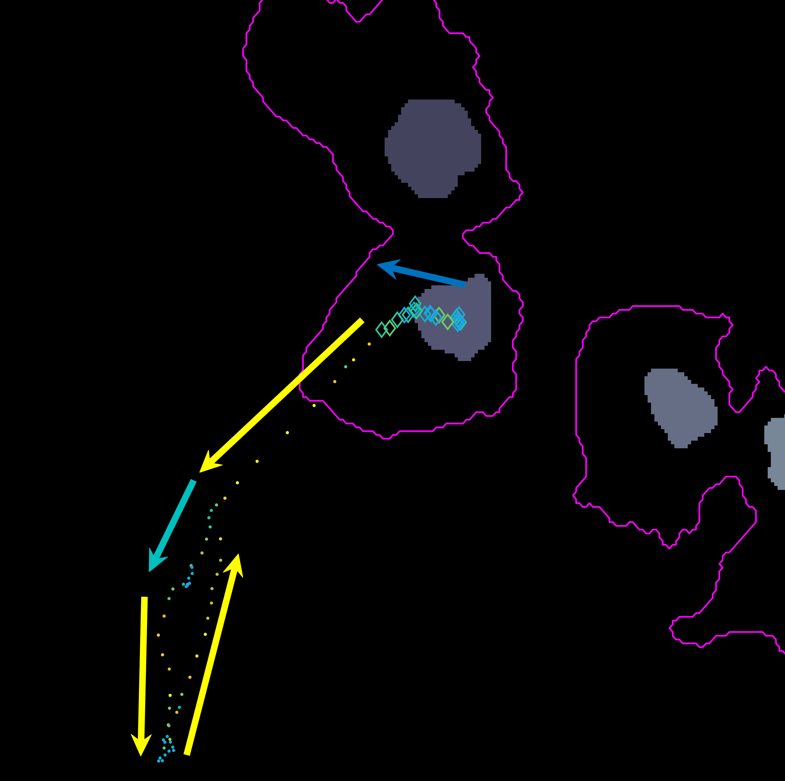
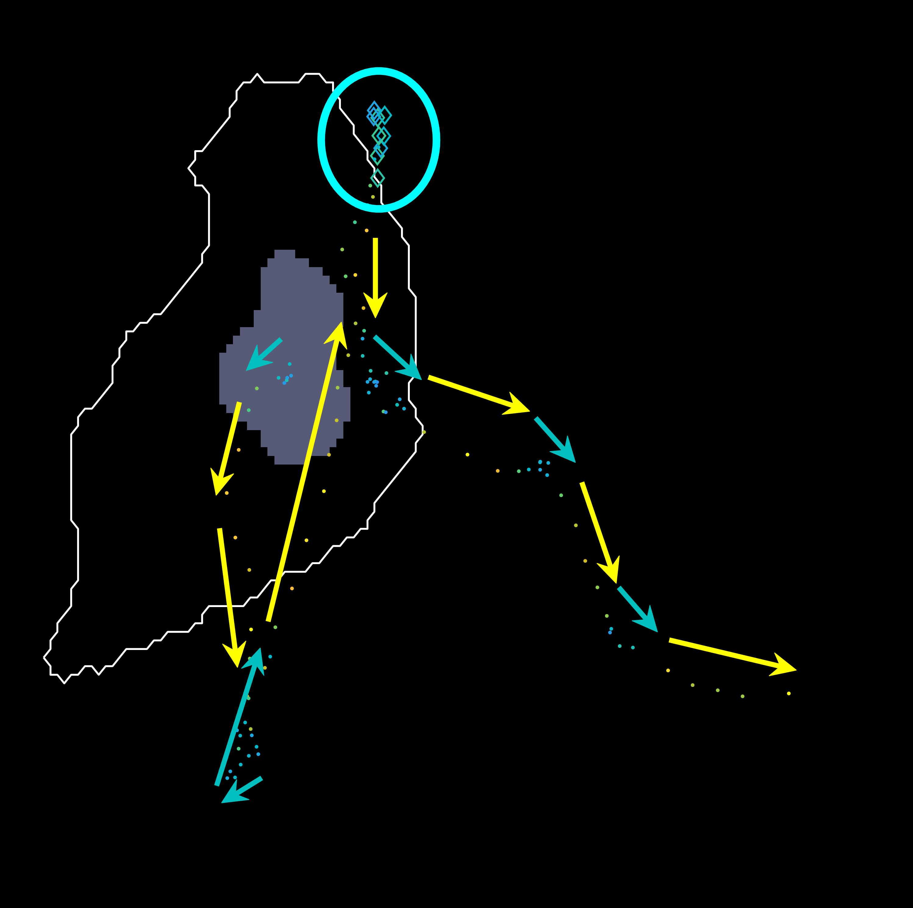

# Movement and interactions of macrophages
This file follows the development of the script
[scr_movementandinteractions.m](../scr_movementandinteractions.m).
In this work, an analysis of the movement of the nuclei in the
**RED** channel will be made, focusing on the interactions that
happen before and after a couple of cells leave a clump.

This log will follow the development of the code. The overall flow
of the work should:
+ Initialise: through [initscript.m](../initscript.m) and by
  choosing a clump `whichclump`.
+ Choose the entries in `tablenet` that contain the tracks in
  `whichclump`. Get them into variable `trackinfo`.
+ Evaluate the tracks and choose an appropriate segment of the
  dataset that shows the cells before and after the clump.
+ Analyse the mean velocity before and after a certain amount of
  frames (10?, 100?, ...)
+ Analyse the direction before and after the clump (how many frames 
  back should I consider the direction to be on? ...)

## Exploration of the data
### Visualisation
Several qualitative tests have been carried out in order to determine the
best course of action for the automated analysis.
Function [`plotframeandpoint.m`](../plotframeandpoint.m) was developed
to show a frame, with the overlapping and non-overlapping cells, while
displaying a set of points of interest.


In the figure, two frames of track `8` are shown; on the left, where the
cell is on its own, and on the right some frames later when the cell is
inside a clump. To represent whether the cell is part of a clump or single,
different markers are used (.) for single and diamonds for clumped cells.
Finally, different colours of the `parula` colourmap are used to display
the different velocities at which the cell is moving in that particular
frame (from blue to yellow).

The [`plotframeandpoint.m`](../plotframeandpoint.m) function has a mode
in which no image is passed to it, which causes only the designated points
to be shown on an already existing image. The following figure showcases
this mode, arrows were added to highlight the direction of the cells during
the time it was clumped and the times it was out of it. The sequence shown
for track `8` is taken from timeframes `267:346` it shows the first frame
in the sequence, and the progression of the cell as time passes. The
velocity of the frame increases significantly after leaving the clump, then
it appears to stop and then switches direction back up.



Following the path set out before, from frames `306:406`, the cell can be
seen switching back to a different clump and then leaving it changing
direction.



### Velocity of nuclei inside and outside of clumps
A small test can be made to find out the velocity of nuclei within clumps
in variable `velclumps` and outside of them using variable `velsingles`.
This can be done through `tablenet` and `clumptracktable` in the following
way:
```Matlab
velsingles = tablenet(clumptracktable.clumpcode==0,:).velocity;
velclumps = tablenet(clumptracktable.clumpcode~=0,:).velocity;
```

| `mean(velclumps) +/- (std)` | `mean(velsingles) +/- (std)` |
|:-----------------:|:------------------:|
| 1.6115 +/- (1.3981) | 2.1671 +/- (1.6470) |

A brief analysis was made to see if the difference between both states
(clump and single) was significant for the mean velocity of the nuclei.
The analysis used `signrank` and it shows that the hypothesis of
`velclumps - velsingles` having zero median cannot be rejected.
