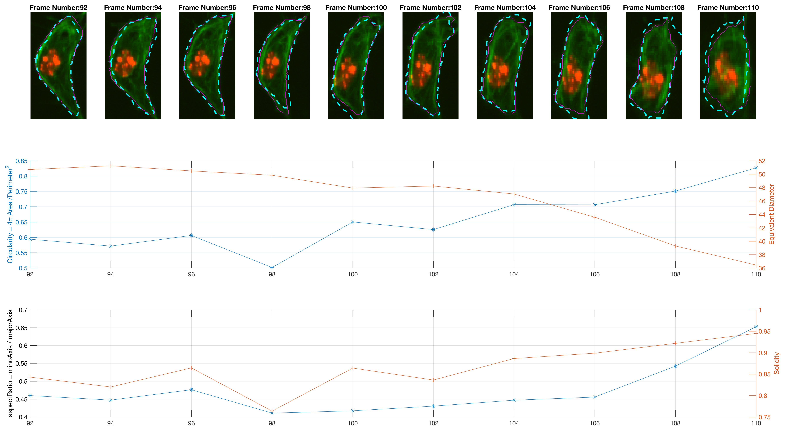
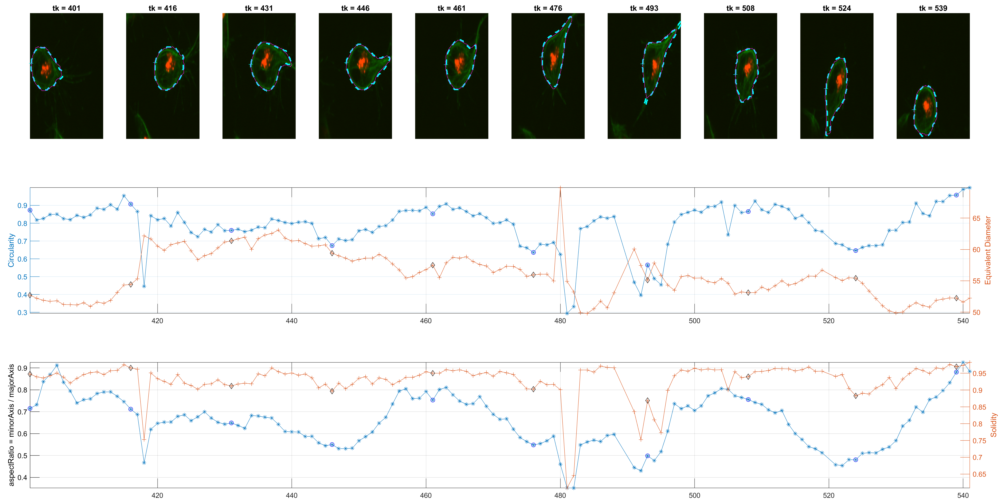
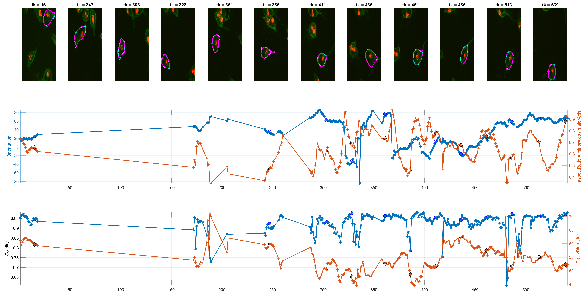

# Single cell analysis: Shape evolution + shape analysis
## General workflow
### I. Initialisation
The following steps are found in the code [initscript.m](../initscript.m),
where if the stored information is found, then it is loaded. On the contrary,
the information is calculated as shown below.

1. Segmentation of both channels with
[`simpleClumpsSegmentation.m`](../simpleClumpsSegmentation.m). This yields the
 clumps and for each frame.
2. Use of [phagosight](https://github.com/alonsoJASL/phagosight) for the
tracking of the **RED** channel.
3. Create upgraded table `tablenet` with the information form
`handles.nodeNetwork` and the addition of the clump information associated to it

### II. Choose a track and follow the GREEN channel in time
The following steps show the process of choosing one of the tracks from the RED
channel, and how they translate to a following of the GREEN channel, along the
non-overlapping tracks.

4. Choose a track.
5. Get all non-overlapping paths of the track. The function
[`getpathsperlabel.m`](../getpathsperlabel.m) carries this task.
6. For each path
    + Load a frame.
    + If there is no previous information on the track, use the GREEN
    segmentation from step **2.**.
    + If there is a segmentation from a previous frame. Update the current
    _unknown_ frame based on the developments in
    [`shapeevolution-iterative.md`](./shapeevolution-iterative.md),
    [`scr-iteravolution-vs-leaking.md`](./scr-iteraiteravolution-vs-leaking.md)
    and [`scr-iterevol-areacontrol.md`](./scr-iterevol-areacontrol.md).

## Full dataset - Experiments and Results
The previous workflow was run on all images from the dataset. Individual
changes can be found on single tracks, as shown in the figure  below.

The program is able to analyse each cell's shape changes in time. The frame
updates in step **6.**, there are two possible ways the active contours
parameters are used. One is a straightforward implementation of parameters that
worked consistently during trials; the other is a more complex way that attempts
to keep control over the area of the updated cell shapes.

Both experiments were run for all independent cells and a `gif` was generated
for both experiments.
### I. Straightforward Active Contours parameters
This is explained in log files
[`shapeevolution-iterative.md`](./shapeevolution-iterative.md) and
[`scr-iteravolution-vs-leaking.md`](./scr-iteraiteravolution-vs-leaking.md).

|      Parameters  | Value  |
|-----------------:|:------:|
|       Iterations |   50   |
|    Smooth factor |   1.5  |
| Contraction bias |  -0.1  |

### II. Area control
This is thoroughly explained in log file
[`scr-iterevol-areacontrol.md`](./scr-iterevol-areacontrol.md). The
parameters used are dependant on the state of the updating cell: _Grow_,
_Shrink_ or _Normal_.

|      Parameters  | Shrink |  Grow | Normal |
|-----------------:|:------:|:-----:|:------:|
|       Iterations |   100  |  200  |   50   |
|    Smooth factor |  1.25  |   1   |   1.5  |
| Contraction bias |   0.1  | -0.25 |  -0.1  |

## Single track - Experiments and Shape analysis
Traditionally,

### Some new measurements
The measurement for circularity seemed noisy and non helpful. The
Orientation was preferred, because it could lead to findings with the

