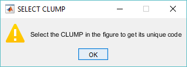
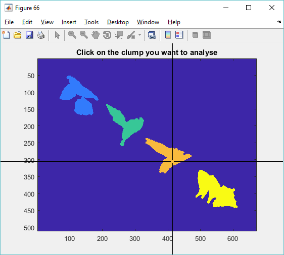

# TUTORIAL: Search for a clump on a frame
One task that could arise from the analysis is the manual selection of clumps.
This was addressed by the function
[`searchClumponFrame.m`](../searchClumponFrame.m), which works by allowing the
user to select a clump from a frame that needs analysing. The code is simple
enough, as long as the appropriate variables are on the workspace, namely, the
`handles` structure that generates from phagosight, followed by the overlapping
analysis of the clumps that can be seen on
[`initscript.m`](../initscript.m).

The user calls the function:

```Matlab
[clumpcode, nucleionclump] = searchClumpOnFrame(handles, 48);
```
Which will prompt an instruction window:



The program loads the frame `fr` specified from `handles.dataLa`, and using the
`clumphandles.overlappingClumps` variable, it displays the available clumps in
the frame, which the user can click on (the function uses `ginput`).



In this example, the output would be `clumpcode=uint64(8002)` and
`nucleionclump=[7;8]`.
