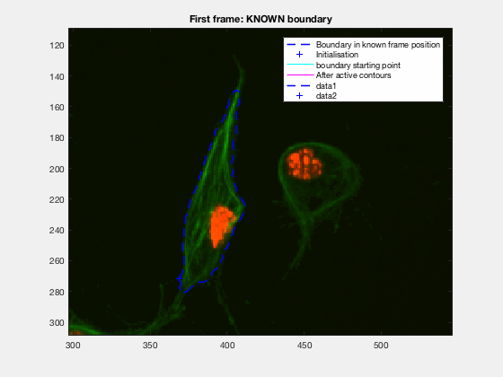
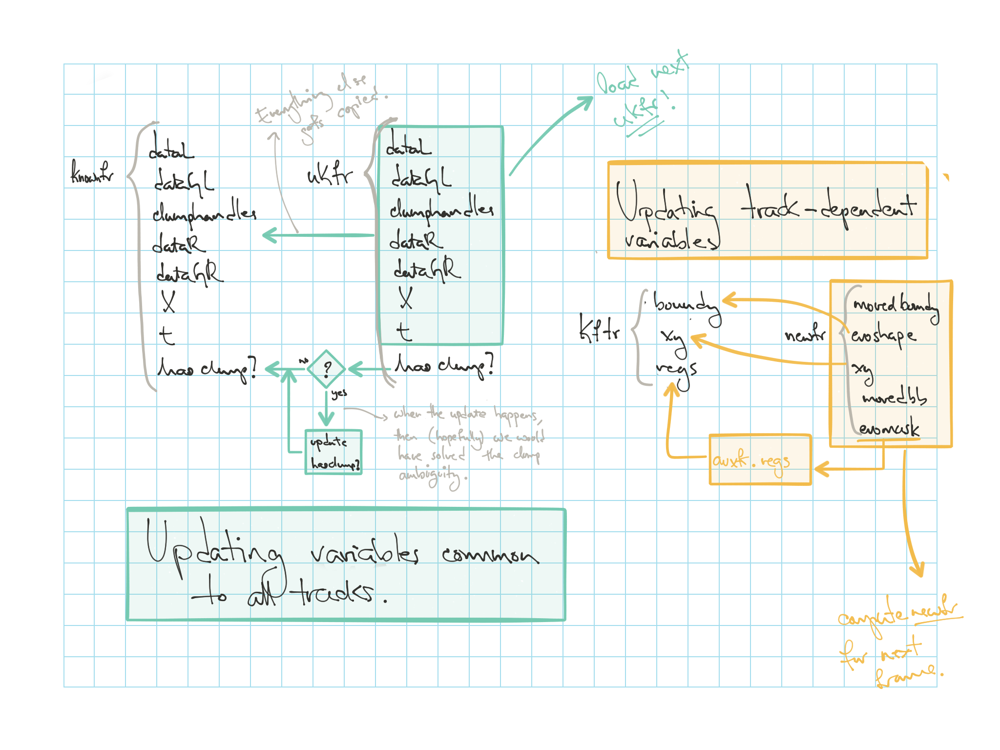
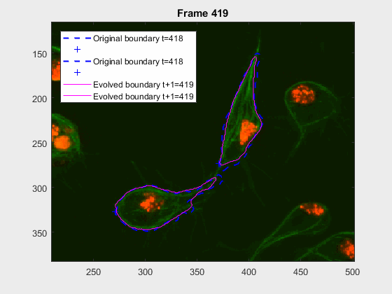
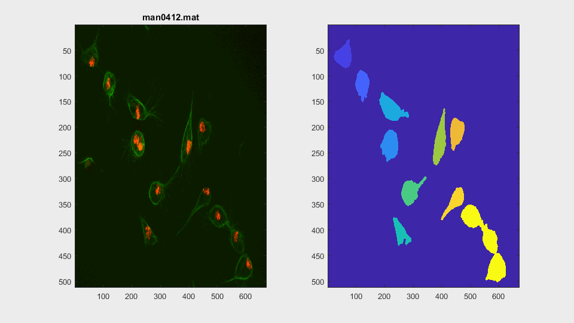
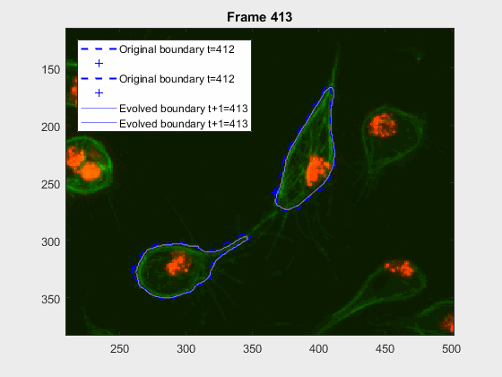

# Iterative Shape Evolution
This log file refers to the code
[`script_iterevolution.m`](../script_iterevolution.m).

## Introduction
One can see in the larger frame leaps `jx>17` that the segmentation is
qualitatively worse. Originally, the focus of this approach is to update
the shape of the unknown frame at each point and take that information onto
the next frame.



This initial test show promise, however, in this case, the known, `knownfr` and
unknown `ukfr` were chosen based on leaps `tj = t0+jx`. A test trying to
construct the frames at each time frame is necessary, in a way that only
the information from the previous frame is carried out to the next one,
this means: `tj = t(j-1) + 1, t(j-1)=t(j-2)+1, ..., t2 = t1+1, t1=t0+1`;
where the **ONLY** completely known frame will be `t0`, and the rest will
be constructed along the way.

## Initialisation
The script [`initscript.m`](../initscript.m) is called, loading the relevant
variables to the workspace. Then, a clump is chosen. The function
[`searchClumpOnFrame.m`](../searchClumpOnFrame.m) can be used to identify
a clump to load. The usual clumps tested are, the ones where the frames that
span the life of the clump are specified:
+ `wuc=8002` useful tracks: `trackinfo(trackinfo.timeframe<418,:) = [];`
+ `wuc=8007`
+ `wuc=8007005` useful tracks:
`trackinfo(~ismember(trackinfo.timeframe, 15:18),:)=[];`
+ `wuc=11010` useful tracks: `trackinfo(trackinfo.timeframe>=144,:)=[];`
+ `wuc=60010`
+ `wuc=60010002`
+ `wuc=15014013`
Two tests will be made: a single _iterative_ following and an _iterative_
cell following with the presence of clumps. The _single following_ will be done
with the cells involved in clump `8002`, studied in
[`shapeanalysis-log.md`](./shapeanalysis-log.md). The _following inside the
clump_ will be done on clumps `8002` starting from frame 415, and `11010`,
starting from frame 1.
### Arranging `trackinfo` variable.
This is allows the table to be better organised.
```Matlab
trackinfo(trackinfo.timeframe<418,:) = [];

aa = table2struct(trackinfo(1:length(clumplab):end,:));
jx=1:length(clumplab):size(trackinfo,1);
fields = {'X','Y','seglabel','track','finalLabel'};
for ix=1:length(jx)
    for kx=1:length(fields)
        auxvect = zeros(1,length(clumplab));
        for qx=1:length(clumplab)
            auxvect(qx) =  trackinfo(jx(ix)+(qx-1),:).(fields{kx});
        end
        aa(ix).(fields{kx}) = auxvect;
    end
    aa(ix).clumpseglabel = aa(ix).seglabel(1)*(aa(ix).clumpcode>0);
end

trackinfo = struct2table(aa);
clear ix jx;
```
## Single cell following
The code developed in [`script_iterevolution.m`](../script_iterevolution.m),
is being written to address both the test case where a single, independent cell
is followed, as well as the actual practical case where a cell is followed
until it overlaps, and then the algorithm is run on it.

## Updating to a new frame



### Full workflow:

##### 1. Load known frame `knownfr` common variables
```Matlab
tk=1;
framet = trackinfo.timeframe(tk);
[knownfr] = getdatafromhandles(handles, filenames{framet});
knownfr.t=framet;
knownfr.hasclump = false;
```
or (easier)...
```Matlab
[knownfr] = getCommonVariablesPerFrame(handles, trackinfo, wuc, ...
        filenames{framet}, framet);
```

##### 2. Compute the tracks' variables in the known frame `kftr`
```Matlab
kftr.regs = regionprops(zeros(size(knownfr.dataGR)), ...
    'BoundingBox', 'Centroid', 'EquivDiameter', 'MajorAxisLength', ...
    'MinorAxisLength');
kftr.boundy = cell(length(clumplab),1);
kftr.xy = zeros(length(clumplab),2);

for wtr=1:length(clumplab)
    % K.F.Tf = Known Frames' TRacks
    thisseglabel = trackinfo.seglabel(tk, wtr);
    thiscell = knownfr.clumphandles.nonOverlappingClumps==thisseglabel;
    regs = regionprops(thiscell, 'BoundingBox', 'Centroid', ...
        'EquivDiameter', 'MajorAxisLength', 'MinorAxisLength');
    boundy = bwboundaries(thiscell);
    xin = trackinfo(trackinfo.timeframe==framet,:).X(wtr);
    yin = trackinfo(trackinfo.timeframe==framet,:).Y(wtr);

    kftr.regs(wtr) = regs;
    kftr.boundy{wtr} = boundy{1};
    kftr.xy(wtr,:) = [xin yin];

    clear thisseglabel thiscell regs boundy xin yin
end
```

##### 3. Steps that would go on a loop.

###### 3.1 Load the unknown frame `ukfr` common variables
```Matlab
tkp1 = tk+1;
frametplusT = trackinfo.timeframe(tkp1);
[ukfr] = getdatafromhandles(handles, filenames{frametplusT});
ukfr.t=frametplusT;
if trackinfo.clumpcode(tkp1) == wuc
    ukfr.hasclump = true;
    ukfr.clumpseglabel = trackinfo.clumpseglabel(tkp1);
    ukfr.thisclump = (oneuk.dataGL==ukfr.clumpseglabel);
else
    ukfr.hasclump = false;
end
```
or much easier...
```Matlab
[ukfr] = getCommonVariablesPerFrame(handles, trackinfo, wuc, ...
        filenames{frametplusT}, frametplusT);
```

###### 3.2. Perform the evolution into `newfr`
now, this one's easy....
```Matlab
[newfr] = nextframeevolution(ukfr, kftr, trackinfo, clumplab);
```

###### 3.3. Show preliminaryresult of `tk+1` shape evolution
```Matlab
plotBoundariesAndPoints(ukfr.X, newfr.movedboundy, newfr.evoshape, 'm-');
title(sprintf('Frame %d', frametplusT));
```

###### 3.4. Update

###### 3.4.1 Update `knownfr`
```Matlab
knownfr = ukfr;
if knownfr.hasclump == true
    knwonfr.hasclump = false;
    knownfr.clumpseglabel = [];
    knownfr.thisclump = [];
end
```
###### 3.4.2 Update `kftr`
```Matlab
auxfr.regs = regionprops(zeros(size(knownfr.dataGR)), ...
    'BoundingBox', 'Centroid', 'EquivDiameter', 'MajorAxisLength', ...
    'MinorAxisLength');
auxfr.boundy = newfr.evoshape;
auxfr.xy = newfr.xy;

for wtr=1:length(clumplab)
    thiscell = newfr.evomask(:,:,wtr)>0;
    regs = regionprops(thiscell, 'BoundingBox', 'Centroid', ...
        'EquivDiameter', 'MajorAxisLength', 'MinorAxisLength');

    auxfr.regs(wtr) = regs;
end

kftr = auxfr;

clear auxfr;
```
## Experiments (and results)
### Clump `wuc=8002` on frames `418:468`
As mentioned before, clump `wuc=8002` was analysed from frame `418` till frame
`468` because it is a range where the cells involved do not overlap, an can be
followed on their own, testing the method's basic premise.

The parameters of the `activecontour` function were defined, for each
frame, as:

|method|iter|smoothf|contractionbias|
|:---:|:---:|:---:|:---:|
|Chan-Vese|50.00|2.00|-0.10|



It can be seen how the cells are followed successfully, which does not impress
anyone, because of the initial positions of the cells.

### Clump `wuc=8002` on frames `412:420`
This experiment takes place in the frames leading up to `417`, where the
clump `wuc=8002` is formed. It is a good initial example to try and lead up the
following of a pair of cells that eventually clash into a clump, but then
separate immediately on the next frame.



The parameters of the `activecontour` function were defined, for each
frame, as:

|method|iter|smoothf|contractionbias|
|:---:|:---:|:---:|:---:|
|Chan-Vese|50.00|2.00|-0.10|

And the results:



This is a very easy clump, as it does not involve overlapping, however it shows
the ability of the method to switch from analysing a frame with or without
clump.

### Clump `11010` on frames `1:35`
This is one of the hardest clumps, because the shapes overlap completely and
the previous information is not enough to do anything.


This shows that the method should probably have some way of detecting these
types of transitions. We could very easily detect when the wrong cell becomes
a clump again. While I can imagine some post processing helping, I do believe
this approach lacks the **information** of the shape to stop the contour to
take up difficult shapes.

### Three cells into clump: `wuc=8007005` on frames `15:18`

Not only disambiguate, but also setting the path for updating the `.mat` files
that contain the segmentations. Solving this clump will lead into solving
clump `8007`.


The following step from this is to **update** the information on `dataGL`
to rid the clump. 
