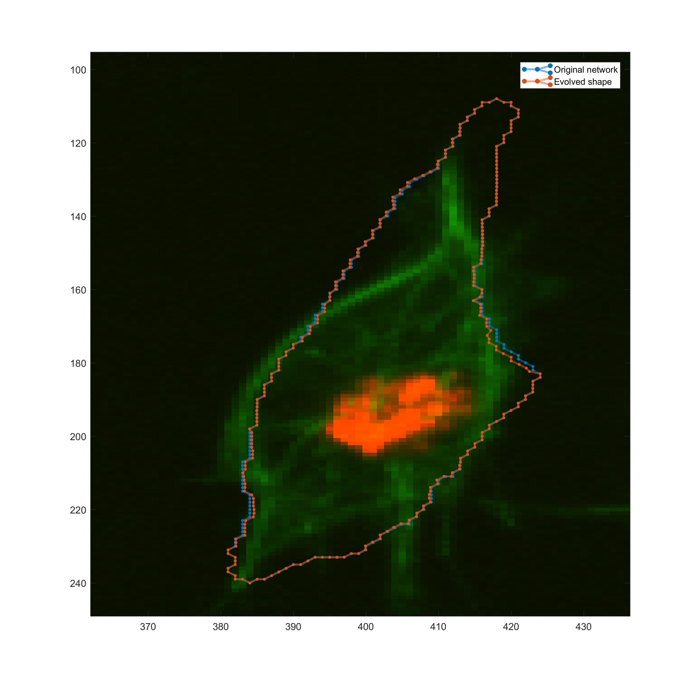
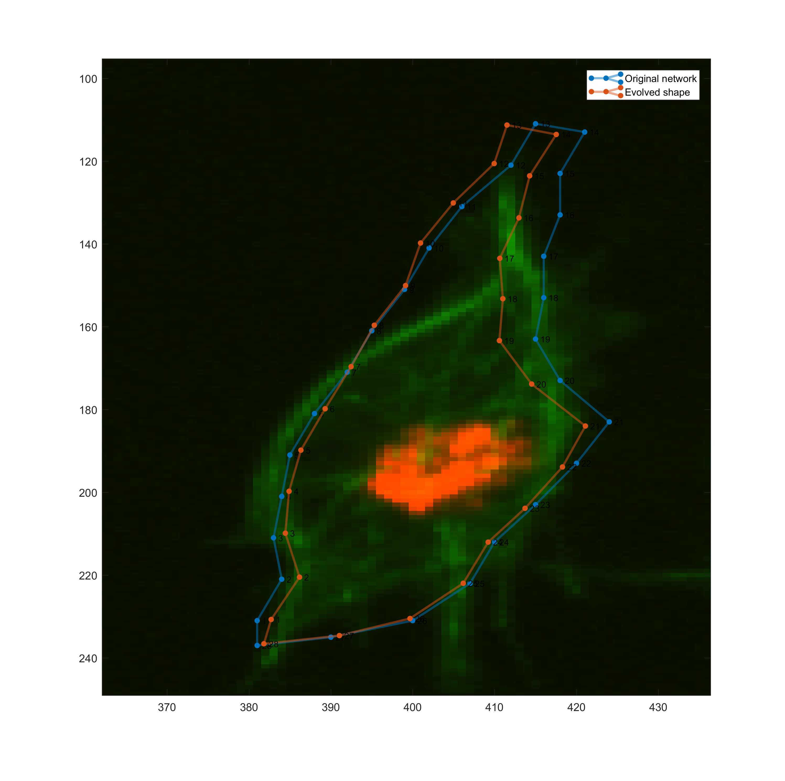
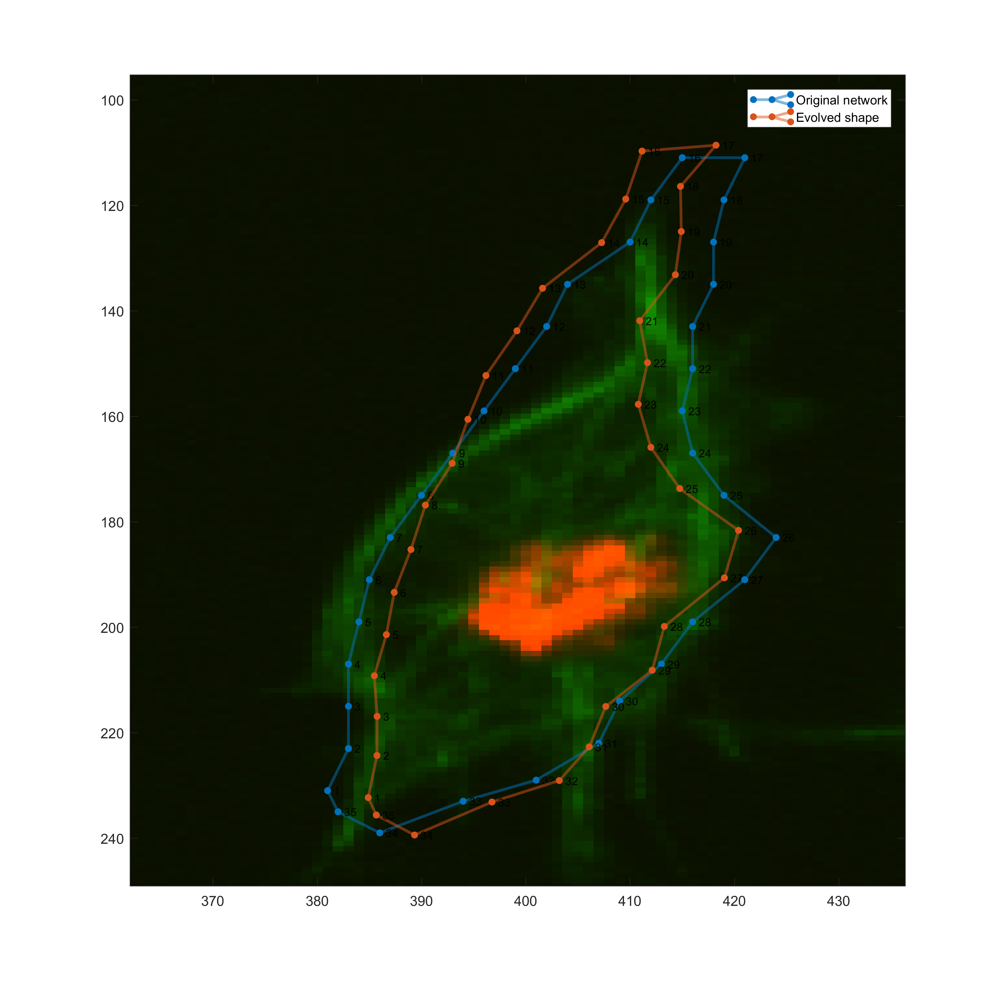
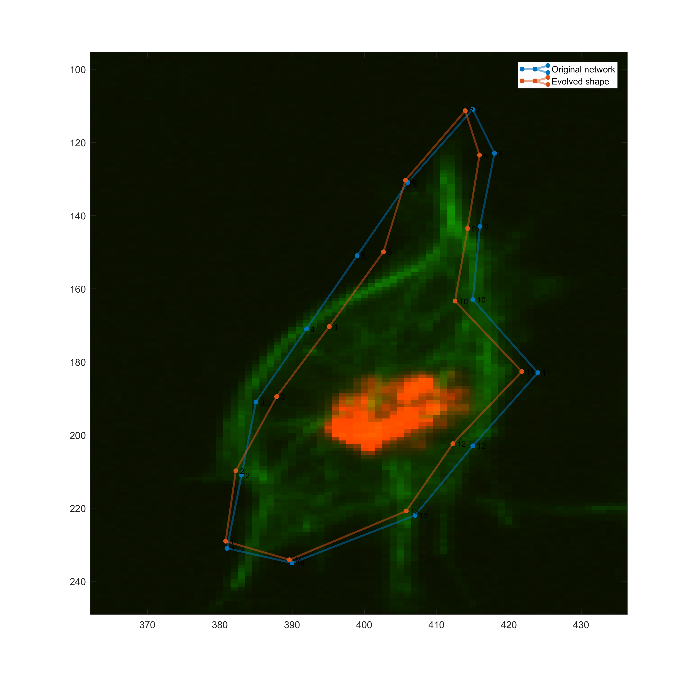
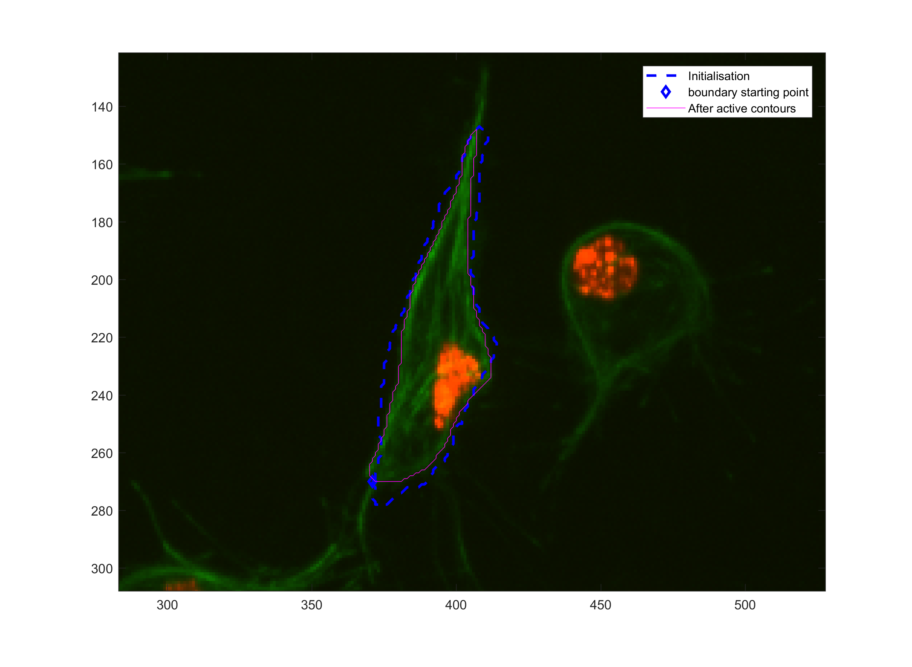
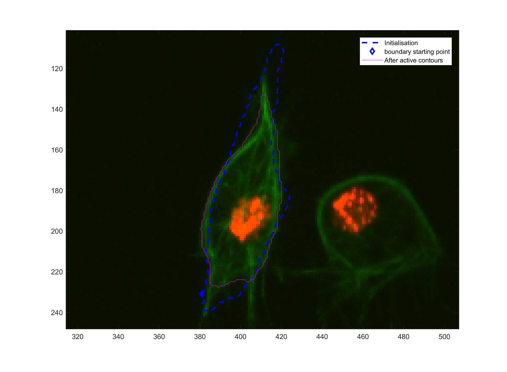

# Evolution of shape from cross correlation following
This log file explains the development of the
[`script_evolveshape`](../script_evolveshape.m) script file.
## Initialisation
The script is initialised by running the [single shape](../script_singleshape.m)
script

Alternatively, if the data is known and has been saved, the user could run
the code:
```Matlab
initscript;
foldername = 'PATH/TO/DATA_mat_XCORR';
experimentName = 'clump8002-tr2.mat';

load(fullfile(foldername, experimentName));
```
### Variables loaded into the workspace.
The variables loaded to the workspace are:
+ `trackinfo`. Contains all the information of the numebr of frames, track
labels and segmentation labels.
+ `knownfr` and `ukfr`, which contain the **known and unknown frames** that
will be analysed.

_One must be really careful when loading these experiments, since the files
tend to get really big (over 2GB for a subset of 80 images). Also, be sure
to be using MATLAB's MAT file storing v7.3 or higher._

### Evolution of shapes (in general)
The evolution of shapes will follow a similar workflow as the file
[`script_shapeandsom.m`](../script_shapeandsom.m), since that is the original
attempt to follow a shape with cross correlation and the evolving it. In this
work, the steps before evolving a shape will be more generic, so that more
techniques can be applied.

The workflow for the evolution of a shape is as follows:
+ Move boundary: this is already done in each `ukfr(jx).`
+ Initialise method (SOM, activecontours, etc)
+ Evolve

To evolve one frame, we chose one of the `ukfr` and choosing one frame that
comes after of the known frame `knownfr`. In the particular example of clump
`8002`, the range is from `1:80` for the value of `jx`. The code below
exemplifies how ONE UnKnown frame is chosen:
```Matlab
ix =1; % this value comes from script_singleshape
jx = 8;
oneuk = ukfr(jx);
```
## Self-organising maps (attempts and results)
This code uses the developments in the
[SOM repo](https://github.com/alonsoJASL/matlab.selforganisingmaps).
Clone or download it and add it to the Matlab `PATH`.
#### Input data
This will be the variable `oneindata`, which is a `MX4` that contains:

| Position      | Intensity values of the image at position `[X Y]` |
|:-------------:|:--------:|
| `[X Y]`       | `[R G]`  |

The code to obtain it from the image, and a binary mask appears below:
```Matlab
mask = bb2mask(oneuk.movedbb, handles.rows, handles.cols);
nuclei = oneuk.dataL==trackinfo.seglabel(ix+jx);
mask = mask-bitand(mask, nuclei);
intensities = oneuk.dataGR.*mask;
oneindata = somGetInputData(intensities, oneuk.X);
```
#### Network topologies
There are two topologies tried in this code, one being a _circle_ or _ring_
topology, and the other one a _grid_. For both, the initial points of the
network need to be provided.

The two variables that need to be defined are the initial position, `pos`,
of the network nodes and the size of the network `netsize`.
##### Circle
In this topology, the variable `pos` will correspond to the positions `[X Y]`
alongside the boundary of the moved boundary `oneuk.movedboundy`. The variable
`netsize` corresponds to `size(pos,1)`
```Matlab
incr = 10;
pos = oneuk.movedboundy(1:incr:end,2:-1:1);
netsize = size(pos,1);
oneuk.OG =  somBasicNetworks('circle', netsize, pos);
```
Notice the variable `incr`, which takes defines how spaced the points in the
network will be.
##### Grid

### SOM training options and parameters.
These involve the number of iterations `maxiter`, the value of the step
`alphazero`, the initial number of neighbours to be taken into account
`N0` as well as others. They are stored in a structure `somopt` and used when
calling the function `somTrainingPlus`.
```Matlab
somopt.maxiter = 1000;
somopt.alphazero = 0.25;
somopt.alphadtype = 'none';
somopt.N0 = 5;
somopt.ndtype = 'exp2';
somopt.debugvar = false;
somopt.steptype = 'intensity';
somopt.gifname = [];

```
#### Outputs
+ Experiment 1

|maxiter|alphazero|alphadtype|N0|ndtype|steptype|incr|
|:---:|:---:|:---:|:---:|:---:|:---:|:---:|
|100.00|0.13|none|5.00|exp2|intensity|1.00|

+ Experiment 2

|maxiter|alphazero|alphadtype|N0|ndtype|steptype|incr|
|:---:|:---:|:---:|:---:|:---:|:---:|:---:|
|100.00|0.25|none|5.00|exp2|intensity|1.00|

+ Experiment 3

|maxiter|alphazero|alphadtype|N0|ndtype|steptype|incr|
|:---:|:---:|:---:|:---:|:---:|:---:|:---:|
|1000.00|0.13|none|8.00|exp2|intensity|10.00|

+ Experiment 4

|maxiter|alphazero|alphadtype|N0|ndtype|steptype|incr|
|:---:|:---:|:---:|:---:|:---:|:---:|:---:|
|500.00|0.25|none|5.00|exp2|intensity|8.00|

+ Experiment 5

|maxiter|alphazero|alphadtype|N0|ndtype|steptype|incr|
|:---:|:---:|:---:|:---:|:---:|:---:|:---:|
|500.00|0.13|none|5.00|exp2|intensity|20.00|



### Problems found (discussion)
+ Grid is hard to initialise to take advantage of the known frame shape.
+ Circle is hard to control.
+ Circle needs less points, but it still does not move as well, and some points
do not get taken into consideration.
## Active Contours (attempts and results)
### Initialisation
#### Input data
#### Network topologies
### Active contours parameters.
#### Random experiments
+ Experiment 1

|framesAhead|method|iter|smoothf|contractionbias|
|:---:|:---:|:---:|:---:|:---:|
|2.00|Chan-Vese|25.00|1.00|0.00|

+Experiment 2

|framesAhead|method|iter|smoothf|contractionbias|
|:---:|:---:|:---:|:---:|:---:|
|8.00|Chan-Vese|25.00|1.00|0.00|

+ Experiment 3

|framesAhead|method|iter|smoothf|contractionbias|
|:---:|:---:|:---:|:---:|:---:|
|8.00|Chan-Vese|100.00|2.00|0.00|

+ Experiment 4
