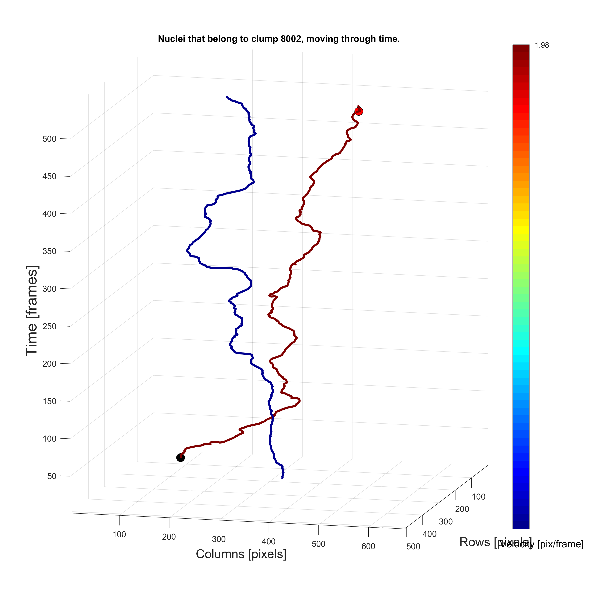
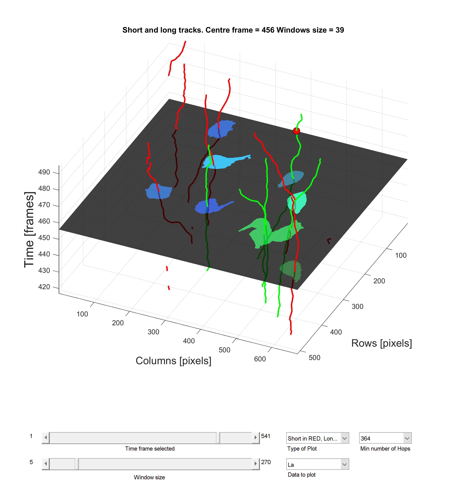
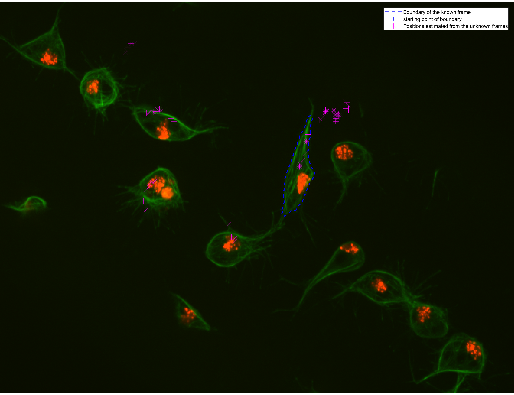

# Shape analysis of a single moving cell
In this log file, the analysis will be made onto one single cell. The
work in this log file refers to the script file
[`script_singleshape.m`](./script_singleshape.m). It loads the main
bulk of information from [`initscript`](./initscript.m), and from there
the analysis is made.

This should serve as a previous step to evaluate the notion of moving a
cell in frame `t` to the position dictated by the maximum correlation
in frame `t+t0`, and use said position as an initialisation of a shape
evolution algorithm.
## Selection of subset and tracks to be analysed
Inside the `MACROS` dataset, track `2` has been identified as a cell
that evolves from frame `t=1` until frame `t=498`.
This track goes through multiple clumps, as seen when displaying all
the clumps that have track `2` in them:
```Matlab
> clumpidcodes(clumpidcodes-fix(clumpidcodes./1000)*1000 ==2)

ans =

  18×1 uint64 column vector

                3002
                4002
                8002
               19002
               50002
               60002
             5003002
             8007002
            60010002
            60013002
            75060002
            79060002
         19008007002
         21005003002
         60013010002
         60014013002
      60014013010002
   61060017014013002
```
In this evaluation, we will focus on clump `8002`, which only appears in
frame `t=417`. This can be displayed with the code:
```Matlab
plotTracks(handles, 2, [2 8]);
```

The figure displays the two tracks (i.e `2` and `8`) that form clump
`8002`. It can be seen that


The analysis will be made from frames `t=418:495`, which can be seen in
the figure below. The selected track is highlighted.


Inspection of the previous image shows that track `8` would also be
suitable for trying in this analysis. The following development will be
done with track `2`, however track `8` could be used as well.
## Isolation of track `2` within the frames of interest
The track number needs to be matched with the label shown on the
segmentation. Because of how the labels are made within @phagosight,
the track number, `tablenet.track`, could differ from the final label,
`tablenet.finalLabel`. Furthermore, both track and final label, also
differ from the segmentation label `tablenet.seglabel`
(the one actually showing in the frame).

An analysis will be made to link the track label to the segmentation label
will be made. The relevant information is already in `handles.finalNetwork`
or better yet, in `tablenet`. The relevant columns: `timeframe`, `seglabel`
`track` and `finalLabel` can be found in the following way:
```Matlab
trackinfo = tablenet(tablenet.track==2,[5 11 13 14]);
```
A selection of the entries of `tablenet` that contain track `2` is already
made. Then, finding the frames to study goes to indexing the new
`trackinfo` variable. In this case, since the tracks spawn from
`t=1`, indexing is straightforward. An example of the first ten entries
of the desired time frames is shown next:
```Matlab
>> trackinfo(418:427,:)

ans =

  10×4 table

    timeframe    seglabel    track    finalLabel
    _________    ________    _____    __________

    418          7           2        2         
    419          7           2        2         
    420          6           2        2         
    421          7           2        2         
    422          6           2        2         
    423          7           2        2         
    424          6           2        2         
    425          6           2        2         
    426          7           2        2         
    427          7           2        2    
```
The `track` and `finalLabel` entries to the table have the same values,
as expected, but the `seglabel` value varies depending on the time frame.
In this simple example, it suffices to delete the entries of
`trackinfo` that will not be used:
```Matlab
 trackinfo(1:417,:)=[];
```
The code that computes this is shown below. We noticed that clump `8002`
is located at the position `ix=8` of the `clumpidcodes` variable loaded
from `initscript`.
```Matlab
% w.u.c = which unique clump!
ix=8;
wuc = clumpidcodes(ix);
clumplab = getlabelsfromcode(wuc);
thistrack = clumplab(1);
trackinfo = tablenet(tablenet.track==2,[5 11 13 14]);
trackinfo(1:417,:)=[];
trackMaxCorr = zeros(size(trackinfo,1),1);
```
## Workflow of the single shape analysis
It is important to notice that
in order to isolate the segmentations of the green channels at the frame
of interest, every column in `trackinfo` corresponds to a parallel array
which can be accessed at the entry `t` when loading a frame.
Such frame `trackinfo.timeframe(ix)` will then have the correct
segmentation label in `trackinfo.seglabel(ix)`.

From the range `418:498`, this code will load one frame, normally `418`,
that will be referred to as the __known frame__, it will be stored in
structure `knownfr`. The rest of the frames will be loaded as the first
one, but it will be assumed that the segmentation for these cells does not
exist, thus they will be called the __unknown frames__ (`ukfr`). Because
of the unknown frames, the __movement+evolution__ analysis proposed here
will be tested.
### Loading the 'known' frame
Select a frame within the 81 available on `trackinfo`. It will contain
the `dataR, dataGR` and `dataL, dataGL` pairs of images, as well as the
`clumphandles` structure that contains the information on the clumps.
```Matlab
ix = 1;
framet = trackinfo.timeframe(ix);

[knownfr] = getdatafromhandles(handles, filenames{framet});
```
Then, add important information to `knownfr`, based on the track that
will be analysed. This information involves the boundary of the cell
that is being studied, as well as its region properties.
```Matlab
thisseglabel = trackinfo.seglabel(ix);
auxbinmat = knownfr.clumphandles.nonOverlappingClumps==thisseglabel;
knownfr.regs = regionprops(auxbinmat, 'BoundingBox', 'Centroid', ...
    'EquivDiameter', 'MajorAxisLength', 'MinorAxisLength');
knownfr.boundy = bwboundaries(auxbinmat);
clear auxbinmat
```
Finally, perform a cross-correlation of the image patch containing the
cell at time `framet`, to get the initial position of the cell.
```Matlab
testImage = imfilter(knownfr.dataGR,imcrop(knownfr.dataGR,...
    knownfr.regs.BoundingBox));
[trackMaxCorr(ix), mxidx] = max(testImage(:));
[yinit, xinit] = ind2sub(size(knownfr.dataGR), mxidx);
knownfr.xy = [yinit xinit];
```
### Reading one of the unknown frames
First, identify the range within `trackinfo.timeframe` with the cells
that will be analysed. If in the previous section `ix=1` was chosen,
then for the analysis, the range would be
`t0 = (ix+1):size(trackinfo,1);` which goes from
`jx=1:size(trackinfo,1)-ix`. The process is really similar to that
described in the previous section.

After loading the basic information, the segmentation label is stored in `.seglabel`.
```Matlab
frametplusT = trackinfo.timeframe(t0(jx));
[auxstruct] = getdatafromhandles(handles, filenames{frametplusT});
auxstruct.seglabel = trackinfo.seglabel(t0(jx));
```
The next step involves the cross correlation with the chopped patch
from the known image `knownfr`. The positions are stored.
```Matlab
testImage = imfilter(auxstruct.dataGR, ...
    imcrop(knownfr.dataGR, knownfr.regs.BoundingBox));

[trackMaxCorr(jx), mxidx] = max(testImage(:));
[yinit, xinit] = ind2sub(size(knownfr.dataGR), mxidx);

auxstruct.xy = [yinit xinit];
auxstruct.test = testImage;
```
Now, the boundary from the known frame, i.e. `knownfr.boundy` is moved
based on the movement of the positions.
```Matlab
auxstruct.movedboundy = knownfr.boundy{1} + ...
    repmat(auxstruct.xy-knownfr.xy, size(knownfr.boundy{1},1),1);
auxstruct.movedbb = knownfr.regs.BoundingBox + ...
    [auxstruct.xy(2:-1:1) 0 0]-[knownfr.xy(2:-1:1) 0 0];
```
Finally, a structure array `ukfr` is updated:
```Matlab
% ukfr = u.k.fr = UnKnown FRame
ukfr(jx) = auxstruct;
```
The movement of the boundary
has been explained in detail in the file
[`script_shapeanalysis.m`](./script_shapeanalysis.m).
### Reading all the unknown frames
For this, a reproduction of the previous section in a `for` loop is
enough to populate all the frames.

An experiment was run where all the calculations described here were
made for the remaining frames in `t0 = (ix+1):size(trackinfo,1)`. All
 the positions in `ukfr.xy` were plotted on top of the known frame
 `knownfr.X`, showing many positions in which `ukfr.xy` was estimated
 completely out of the area of interest.

 _It is safe to assume that this would not happen when disambiguating a
 clump, since the cross correlation would only be done comparing
 the known frame with the intensities in `ukfr.dataGR` that are contained
 in the clump_

 

Some of the positions shown are completely off, however, it can be noted
that many do follow the apparent tracks of the 

##### Detecting frames where `ukfr` was not estimated correctly
Displaying the
##### Some useful plots
